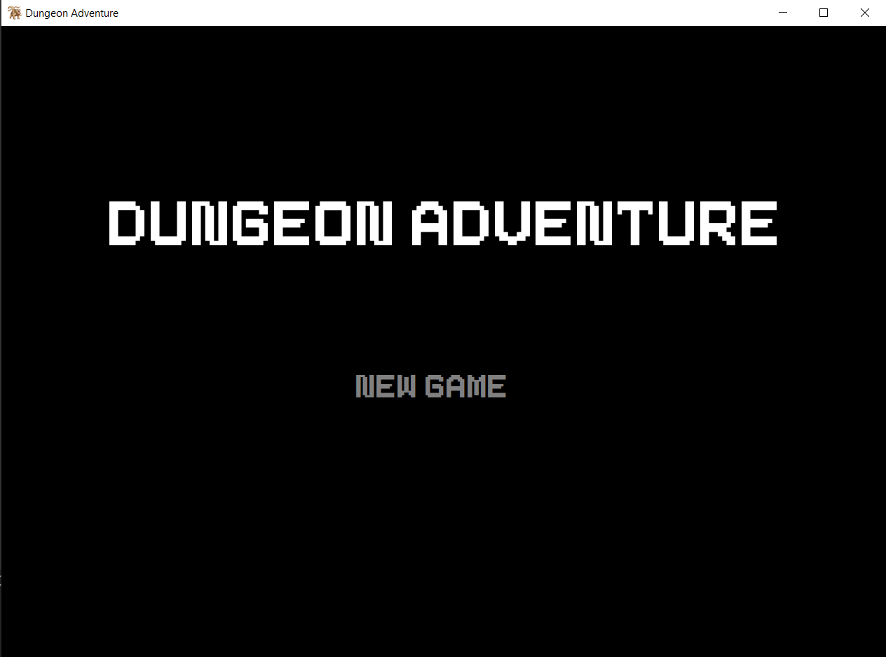
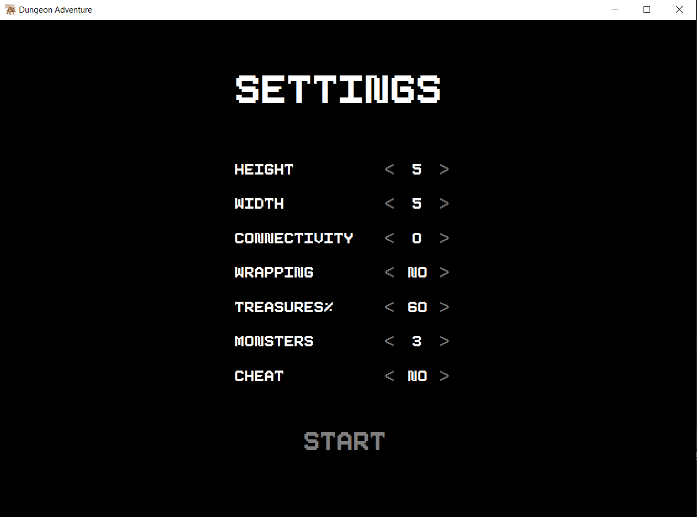
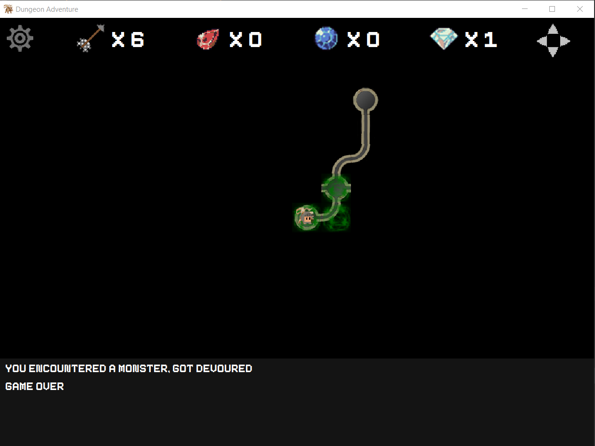

# CS5010 Final Project

Dungeon adventure game made with Java Swing

## How to run

prebuilt jar file is in res/Project05.jar

run with
```
java -jar Project05.jar
```

## Example





## Credits

Assets:

- Arrow: https://arydian.itch.io/simple-wooden-bow-and-arrows
- Chest: https://admurin.itch.io/free-chest-animations
- Player: https://camkoalatixd.itch.io/2d-knight-platformer
- Gems: https://opengameart.org/content/gem-icons
- Font: https://freedesignresources.net/free-pixeboy-pixel-font